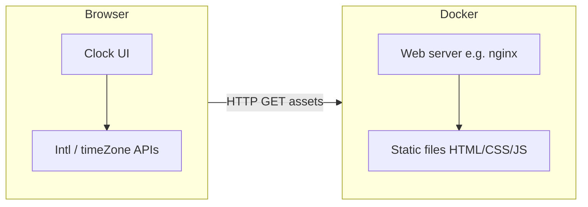

# Product Requirements Document (PRD): Multi-Timezone Clock Page

## 1. Document control

| Field | Value |
|--------|--------|
| Product | Web-based multi-timezone clocks |
| Audience | Engineering, design, stakeholders |
| Language | American English |
| Status | Draft for implementation |

---

## 2. Overview

### 2.1 Problem

People who work across time zones need a simple, always-on reference that shows **local time** alongside **one or more other zones**, without juggling OS widgets or browser tabs.

### 2.2 Solution

A **single web page** served from a **Dockerized web server** that displays:

1. **Primary clock (left, fixed column):** the viewer’s **current local timezone**, detected in the browser (not guessed by the server).
2. **Secondary clock(s) (to the right):** one or more clocks whose **IANA timezone** the user selects (e.g. `America/New_York`, `Europe/Paris`).
3. A **“+” control** to **add additional timezone clocks** without a fixed upper limit (within reasonable browser performance).

### 2.3 Success criteria

- Local clock always reflects the machine’s actual local offset (including DST transitions while the tab stays open, if the browser updates `Intl` correctly).
- User can pick any supported IANA zone for each configurable clock.
- User can add many clocks; layout remains usable on desktop and acceptable on mobile (scroll or wrap).
- Page loads from a container with a documented `docker run` / Compose flow.

---

## 3. Goals and non-goals

### 3.1 Goals

- Ship as **static or minimally dynamic** front-end assets behind **nginx** (or similar) in Docker.
- **No account / no backend persistence** required for v1 (optional stretch: persist in `localStorage`).
- **Accessible** labels (clock role, timezone name, readable contrast).
- **Correct DST** handling via browser APIs (`Intl`, `Temporal` if available and you standardize on it).

### 3.2 Non-goals (v1)

- Server-side timezone conversion as source of truth (server only serves files).
- Meeting scheduler, calendar integration, or alarms.
- “World clock” city database with search across 500k cities (simple zone picker is enough).

---

## 4. User stories

1. **As a user**, I want my **left clock** to always show **my current location’s time** so I never misconfigure “home” time.
2. **As a user**, I want a **right-hand clock** whose **timezone I choose** so I can track a remote team or region.
3. **As a user**, I want to tap **“+”** to **add another timezone clock** when I follow more than one region.
4. **As a user**, I want to **remove** a clock I added (except the fixed local one) so the UI stays tidy.
5. **As a user**, I want **clear names** (city or zone label + offset) so I know which clock is which.

---

## 5. Functional requirements

### 5.1 Layout and behavior

| ID | Requirement |
|----|----------------|
| FR-1 | Page shows **at least two** clocks on first load: **Local (left)** + **one configurable zone (right)**. |
| FR-2 | **Local clock** is **non-removable** and **always uses the browser’s local timezone**. |
| FR-3 | **Configurable clocks** appear **to the right** of the local clock (or below on narrow viewports). |
| FR-4 | **“+”** adds a new configurable clock with a **default zone** (e.g. UTC or last-used zone—product decision). |
| FR-5 | Each configurable clock has: **timezone selector**, **current time display**, **date** (optional but recommended), **offset** (e.g. `GMT-5`), **remove** (except local). |
| FR-6 | Clocks **update every second** (or every minute if you prefer battery-friendly mode—document choice). |
| FR-7 | Invalid or unsupported zone selection shows a **non-blocking error** and falls back to a safe default. |

### 5.2 Timezone selection

- Use **IANA time zone identifiers** as the stored value and for all `Intl` calculations (e.g. `America/Los_Angeles`).
- Picker can be: searchable `<select>` populated from `Intl.supportedValuesOf('timeZone')` where available, or a curated list + “Other…” for v1.
- **Civil abbreviations (EST, IST, PST, …):** the UI shows a **short zone name** from `Intl` (e.g. `EST`, `IST`) as the primary clock title, with the **IANA id** on a second line. The picker lists a **curated shortcut table** (US/Canada STD+DST pairs, UK GMT/BST, EU CET/CEST, major hubs in Latin America, Africa, Middle East, Asia, Oceania, etc.) so users can search by classic tokens; **several abbreviations may map to the same IANA** (e.g. EST+EDT → `America/New_York`), merged into one picker line. Mexico uses **MEX** (not **CST**) to avoid clashing with US Central. **EGY** is used for Egypt instead of overloading **EET**. Every shortcut IANA is validated in unit tests.

### 5.3 Docker delivery

- Image runs a web server that serves `index.html` and static assets on a **documented port** (e.g. `8080`).
- README includes **build**, **run**, and **health** expectations (optional: simple `GET /` 200).

---

## 6. UX / UI notes

- **Visual hierarchy:** Local clock slightly emphasized; primary label uses **“Local — {abbr}”** (abbreviation from `Intl` for the device zone) with **IANA** as secondary text. Extra clocks use **abbreviation as the main title** and **IANA** underneath.
- **Responsive:** Horizontal row on wide screens; stacked or horizontal scroll on small screens.
- **Controls:** Primary “+” near the clock row header; per-clock overflow menu or explicit remove icon to avoid mis-clicks.
- **Copy:** American English strings in UI (“Time zone”, “Add clock”, “Remove”).

---

## 7. Technical plan

### 7.1 High-level architecture



- **Rendering and time math** happen **entirely in the browser**.
- **Docker** packages **static assets** only (unless you add a later phase with an API).

### 7.2 Recommended stack (pragmatic defaults)

| Layer | Choice | Rationale |
|--------|--------|-----------|
| Container base | `nginx:alpine` | Small image, proven static hosting |
| Front-end | **Vanilla TS** or **React/Vite** | Vanilla keeps image and build tiny; React if you expect richer UI soon |
| Styling | CSS modules or Tailwind | Tailwind speeds layout; plain CSS is fine for one page |
| Time APIs | `Intl.DateTimeFormat` + `timeZone` option | Broad support; correct DST for IANA zones |
| Zone list | `Intl.supportedValuesOf('timeZone')` when defined; else polyfill / static subset | Feature detection in one utility |
| Abbreviations | `timeZoneName: 'short'` via `formatToParts` | Display-only; may vary by engine (e.g. `EST` vs `GMT-5`) |
| Shortcuts | Curated `{ abbr, description, iana }[]` merged into filter results | Search “IST”, “EST”, etc. without ambiguous auto-inference beyond the table |

### 7.3 Front-end state model (conceptual)

```ts
type ClockId = string; // uuid

interface AppState {
  localClock: { id: 'local'; kind: 'local' };
  extraClocks: Array<{ id: ClockId; ianaTimeZone: string; label?: string }>;
}
```

- **Initialization:** `extraClocks` length ≥ 1 for the default “right” clock (e.g. `UTC`).
- **Add:** push new `{ id, ianaTimeZone }`.
- **Remove:** filter by `id` (never remove `local`).

### 7.4 Time display implementation sketch

- On an interval (`setInterval` 1000 ms) or `requestAnimationFrame` throttled to 1 Hz:
  - For local: `timeZone` omitted or set from `Intl.DateTimeFormat().resolvedOptions().timeZone`.
  - For others: `new Intl.DateTimeFormat('en-US', { timeZone, hour12: true, ... })`.
- Show **abbreviation** where possible via `timeZoneName: 'shortGeneric'` or `'short'` (be aware abbreviations can be ambiguous—pair with IANA in subtitle).

### 7.5 Docker / repo layout

Suggested repository layout:

```
/
  Dockerfile
  nginx.conf          # optional: caching headers, gzip, SPA fallback if needed
  public/ or dist/    # built assets
  src/                # if using a bundler
  README.md           # docker build/run
```

**Dockerfile (conceptual):**

- Stage 1 (optional): `node:alpine` → `npm ci` → `npm run build`.
- Stage 2: copy `dist/` into `/usr/share/nginx/html`.

**Run:**

- `docker build -t world-clocks .`
- `docker run --rm -p 8080:80 world-clocks`

### 7.6 Quality bar

- **Lint/format:** ESLint + Prettier (if TS/React).
- **Tests (light):** unit tests for a small `formatZonedNow(iana, locale)` helper with fixed `Date` mocks (DST edge cases optional follow-up).
- **Performance:** debounce search in timezone picker; avoid re-rendering all clocks on every keystroke if list is huge.

### 7.7 Security and privacy

- No PII collected; no geolocation API required (local clock uses system timezone).
- Serve with **default security headers** in nginx if you extend scope (`X-Content-Type-Options`, etc.).

### 7.8 Risks and mitigations

| Risk | Mitigation |
|------|------------|
| DST jumps / ambiguous local times | Rely on `Intl`; show date + offset |
| Huge timezone list in old browsers | Feature-detect; ship curated fallback list |
| User adds dozens of clocks | Cap UI height with scroll; optional soft warning |
| Wrong “local” if OS timezone wrong | Out of scope; document that it mirrors OS settings |

---

## 8. Milestones

1. **M1 – Static page + local + one zone + tick** (no Docker polish).
2. **M2 – Add/remove clocks + timezone picker + responsive layout.**
3. **M3 – Dockerized nginx + README + tagged image.**
4. **M4 (optional) – Persist last layout/zones in `localStorage`; export/share URL with query params.**

---

## 9. Open decisions (to lock)

1. **Default second zone:** `UTC` vs last user choice vs `America/New_York`.
2. **12h vs 24h:** follow `en-US` vs user toggle.
3. **Persistence:** none vs `localStorage` vs URL state.
