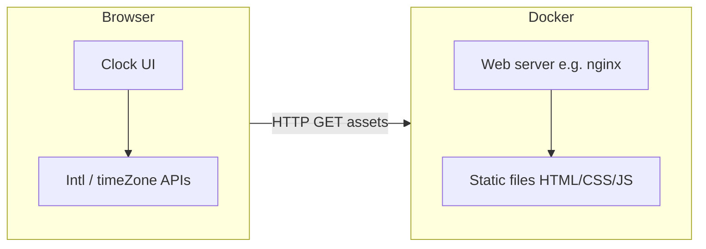

# Product Requirements Document (PRD): Multi-Timezone Clock Page

## 1. Document control

| Field | Value |
|--------|--------|
| Product | **ocloque** — web-based multi-timezone clocks |
| Audience | Engineering, design, stakeholders |
| Language | American English (UI copy) |
| Status | **Implemented (v1)** |
| Technical plan | [`docs/TECH-PLAN.md`](./TECH-PLAN.md) (source of truth for stack, modules, tests, Docker) |

---

## 2. Overview

### 2.1 Problem

People who work across time zones need a simple, always-on reference that shows **local time** alongside **one or more other zones**, without juggling OS widgets or browser tabs.

### 2.2 Solution

A **single web page** served from a **Dockerized web server** that displays:

1. **Primary clock (left, fixed column):** the viewer’s **current local timezone**, detected in the browser (not guessed by the server).
2. **Secondary clock(s) (to the right):** one or more clocks whose **IANA timezone** the user selects (e.g. `America/New_York`, `Europe/Paris`).
3. A **“+” control** to **add additional timezone clocks** without a fixed upper limit (within reasonable browser performance).

### 2.3 Success criteria

- Local clock always reflects the machine’s actual local offset (including DST transitions while the tab stays open, if the browser updates `Intl` correctly).
- User can pick any supported IANA zone for each configurable clock.
- User can add many clocks; layout remains usable on desktop and acceptable on mobile (scroll or wrap).
- Page loads from a container with a documented `docker run` / Compose flow.

---

## 3. Goals and non-goals

### 3.1 Goals

- Ship as **static** front-end assets behind **nginx** in Docker.
- **No account / no backend persistence** required for v1 (optional stretch: persist in `localStorage`).
- **Accessible** labels (clock role, timezone name, readable contrast).
- **Correct DST** handling via browser **`Intl`** APIs.

### 3.2 Non-goals (v1)

- Server-side timezone conversion as source of truth (server only serves files).
- Meeting scheduler, calendar integration, or alarms.
- “World clock” city database with search across 500k cities (simple zone picker is enough).

---

## 4. User stories

1. **As a user**, I want my **left clock** to always show **my current location’s time** so I never misconfigure “home” time.
2. **As a user**, I want a **right-hand clock** whose **timezone I choose** so I can track a remote team or region.
3. **As a user**, I want to tap **“+”** to **add another timezone clock** when I follow more than one region.
4. **As a user**, I want to **remove** a clock I added (except the fixed local one) so the UI stays tidy.
5. **As a user**, I want **clear names** (abbreviation / offset + IANA) so I know which clock is which.
6. **As a user**, I want to **type a calendar date and clock time in that face’s zone** (instead of thinking in “offsets”) so I can freeze or compare a specific wall time; I can return to **live** time with one control.

---

## 5. Functional requirements

### 5.1 Layout and behavior

| ID | Requirement |
|----|----------------|
| FR-1 | Page shows **at least two** clocks on first load: **Local (left)** + **one configurable zone (right)**. |
| FR-2 | **Local clock** is **non-removable** and **always uses the browser’s local timezone**. |
| FR-3 | **Configurable clocks** appear **to the right** of the local clock (or below on narrow viewports). |
| FR-4 | **“+”** adds a new configurable clock with default zone **`UTC`** (v1). |
| FR-5 | Each configurable clock has: **filter** + **timezone** `<select>`, **manual time** block (calendar **date** + **hour 0–23** + **minute 0–59** in **that zone**, **Apply**, **Use live time**), **live time** display, **date**, **offset**, **Remove** (except local). Picker options use **stable shortcut labels** where defined (see §5.2). |
| FR-6 | The **local** clock has the same **manual time** block. Manual time does **not** change the OS timezone; it pins the **displayed** instant for that card. |
| FR-7 | When a face is **live**, it **updates every second** (v1). When **pinned**, it keeps showing that wall time in the zone (the underlying UTC instant is fixed until cleared). |
| FR-8 | Invalid or unsupported IANA values **fall back to `UTC`** in logic (silent in UI v1). |
| FR-9 | Invalid wall times in a zone (e.g. non-existent DST hour) are rejected with a **browser `alert`**; user adjusts inputs and retries. |

### 5.2 Timezone selection

- Use **IANA time zone identifiers** as the stored value and for all `Intl` calculations (e.g. `America/Los_Angeles`).
- Picker is backed by **`Intl.supportedValuesOf('timeZone')`** when available, plus a **curated shortcut table** for classic abbreviations and regions.
- **Civil abbreviations (EST, IST, PST, …):** the UI shows a **short zone name** from `Intl` as the primary clock title where available, with the **IANA id** on a second line. The picker lists shortcuts (US/Canada STD+DST pairs, UK GMT/BST, EU CET/CEST, major hubs in Latin America, Africa, Middle East, Asia, Oceania, etc.); **several abbreviations may map to the same IANA** (e.g. EST+EDT → `America/New_York`), merged into one picker line. Mexico uses **MEX** (not **CST**) to avoid clashing with US Central. **EGY** is used for Egypt instead of overloading **EET**. Every shortcut IANA is validated in unit tests.

### 5.3 Manual wall time (per face)

- The user enters a **calendar date** and **time-of-day** interpreted in **that clock’s IANA zone** (or the browser’s local zone for the left card). **Apply** resolves them to a single UTC instant (via **Luxon**) and the face formats that instant with `Intl` until **Use live time** clears the pin.
- Pins are **display-only** and **not persisted** in v1 (refresh clears them).

### 5.4 Docker delivery

- Image runs a web server that serves `index.html` and static assets on a **documented port** (e.g. `8080` via Compose).
- README includes **build** and **run** instructions; image build runs **tests** before emitting assets.

---

## 6. UX / UI notes

- **Visual hierarchy:** Local clock slightly emphasized; primary label uses **“Local — {abbr}”** (`Intl` short name for the device zone) with **IANA** as secondary text. Extra clocks use **abbreviation as the main title** and **IANA** underneath.
- **Responsive:** Horizontal row on wide screens; stacked or horizontal scroll on small screens.
- **Controls:** Primary “+” in the header; per-clock **Remove**; **Filter** + zone `<select>`; **Set time in this zone** (date + hour + minute, **Apply** / **Use live time**). Pinned faces show **`· fixed time`** next to the IANA line.
- **Copy:** American English strings in UI (“Time zone”, “Add clock”, “Remove”, “Apply”, “Use live time”, “Set time in this zone”, …).

---

## 7. Technical plan (summary)

The **full** technical plan (architecture, file layout, stack versions, test matrix, Docker pipeline, risks) is maintained in **[`docs/TECH-PLAN.md`](./TECH-PLAN.md)**. Below is a short stakeholder summary.

### 7.1 High-level architecture



- **Rendering and time math** happen **entirely in the browser**.
- **Docker** packages **static assets** only (no API in v1).

### 7.2 Implemented stack (v1)

| Layer | Choice |
|--------|--------|
| Container base | `nginx:1.27-alpine` |
| Build | `node:22-alpine` — `npm ci`, **`npm test`**, `vite build` |
| Front-end | **Vite 6 + vanilla TypeScript** (DOM, no React) |
| Styling | Plain **`src/style.css`** |
| Time APIs | `Intl.DateTimeFormat` + `timeZone` + `formatToParts` |
| Wall-time pins | **Luxon** (`DateTime.fromObject` in zone) | Resolve user date/time in IANA to UTC ms |
| Zone list | `Intl.supportedValuesOf('timeZone')` + `UTC` injection when missing |
| Shortcuts | `ZONE_SHORTCUTS` + `filteredIanaZones` + merged picker labels |
| Tests | **Vitest 3** + **jsdom** |

### 7.3 Front-end state model (as implemented)

```ts
type ClockId = string; // uuid

interface AppState {
  localPinnedUtcMs: number | null; // null = live local face
  extraClocks: Array<{ id: ClockId; ianaTimeZone: string; pinnedUtcMs: number | null }>;
}
```

- **Initialization:** `localPinnedUtcMs = null`; one extra clock at **`UTC`** with `pinnedUtcMs = null`.
- **Add:** append `{ id, ianaTimeZone, pinnedUtcMs: null }` (default zone **`UTC`**).
- **Remove:** filter by `id` (never remove `local`).

---

## 8. Milestones

| Milestone | Scope | Status |
|-----------|--------|--------|
| M1 | Static page + local + one zone + tick | **Done** |
| M2 | Add/remove clocks + timezone picker + responsive layout | **Done** |
| M3 | Dockerized nginx + README | **Done** |
| M4 (optional) | Persist last layout/zones in `localStorage`; export/share URL with query params | **Not started** |

---

## 9. Product decisions (v1 — locked)

1. **Default second zone:** **`UTC`**.
2. **12h vs 24h:** **`en-US` 12-hour** formatting via `Intl`.
3. **Persistence:** **none** (refresh resets extras to initial state unless changed in code).

---

## 10. References

- [`docs/TECH-PLAN.md`](./TECH-PLAN.md) — implementation technical plan
- [`docs/progress.md`](./progress.md) — engineering log
