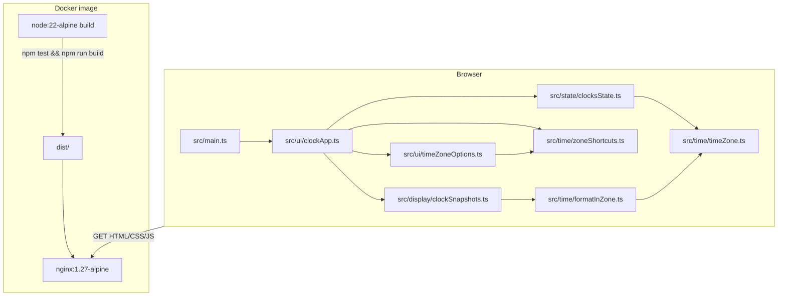

# Technical plan — ocloque

This document is the **implementation-level** companion to [`PRD.md`](./PRD.md). It reflects the **current** codebase (v1).

---

## 1. Purpose

Deliver a static single-page app (SPA) that shows **local time** plus **one or more IANA-based clocks**, built with **TypeScript**, tested with **Vitest**, and served via **nginx** in **Docker**. All time calculations run in the **browser** using **`Intl`**.

---

## 2. Architecture



---

## 3. Repository layout

```
/
  Dockerfile              # multi-stage: Node build → nginx static
  docker-compose.yml      # web:8080 → container:80
  nginx.conf              # gzip, try_files for SPA
  index.html              # Vite entry
  package.json
  vite.config.ts          # Vitest env: jsdom
  tsconfig.json
  README.md
  docs/
    PRD.md
    TECH-PLAN.md          # this file
    progress.md           # engineering log
  src/
    main.ts               # mounts createClockApp(#app)
    style.css
    time/
      timeZone.ts         # listIanaTimeZones, normalize, isValid
      formatInZone.ts     # formatInstantInZone, formatTimeZoneAbbreviation
      zoneShortcuts.ts    # ZONE_SHORTCUTS, shortcutSelectLabel
    state/
      clocksState.ts      # immutable state: localOffsetHours + extras (iana + offsetHours)
    display/
      clockSnapshots.ts   # buildClockSnapshots(now, localIana, localOffset, extras)
    ui/
      clockApp.ts         # DOM, interval tick, select/filter wiring
      timeZoneOptions.ts  # filteredIanaZones
    …                     # Vitest specs colocated as *.test.ts
```

---

## 4. Stack (as implemented)

| Concern | Choice | Notes |
|--------|--------|--------|
| Language | TypeScript 5 | `strict`, `tsc --noEmit` in `npm run build` |
| Bundler / dev | Vite 6 | `npm run dev`, `vite build` → `dist/` |
| UI | Vanilla TS + DOM | No React in v1 |
| Styles | Plain CSS | `src/style.css`, responsive flex layout |
| Tests | Vitest 3 + jsdom | `npm test`; DOM smoke in `clockApp.test.ts` |
| Container build | Node 22 Alpine | `npm ci`, **`npm test` gate**, then `vite build` |
| Runtime image | nginx 1.27 Alpine | Static `dist/`; custom `nginx.conf` |

Linting (ESLint/Prettier) is **not** wired in v1; optional follow-up.

---

## 5. Behavioral rules

### 5.1 Clock model

- **Local** clock: `Intl.DateTimeFormat().resolvedOptions().timeZone`; not removable. **`localOffsetHours`** (−23…+23, clamped) shifts only the **rendered** instant for that card.
- **Extra** clocks: `{ id, ianaTimeZone, offsetHours }[]` in immutable state; default initial zone **`UTC`** with **`offsetHours: 0`**; **`+`** appends another (defaults **`UTC`**, offset **0**); **Remove** deletes one extra.

### 5.2 Tick vs DOM updates

- **`setInterval` (1 s)** refreshes **only** text fields (time, date, offset, headings) from `buildClockSnapshots` so `<select>` option lists are **not** rebuilt every second (performance + focus).
- **Full card rebuild** runs on add/remove extra clock or when rebuilding the row after structural change.

### 5.3 Time zone picker

- **IANA list:** `Intl.supportedValuesOf('timeZone')` when available; sorted with `localeCompare`; **`UTC`** appended if missing (Node quirk).
- **Shortcuts:** `ZONE_SHORTCUTS` — curated `{ abbr, description, iana }`; multiple rows may share one **IANA** (e.g. EST/EDT → `America/New_York`). **`shortcutSelectLabel`** merges them for stable **picker** text (avoids summer-only “EDT” hiding “EST”).
- **Clock card titles** still use **`Intl` `timeZoneName: 'short'`** (may show EDT/GMT-style strings); **IANA** always on second line.
- **Filter:** `filteredIanaZones` merges shortcut matches + substring match on IANA; prepends **selected** only when it **matches the query** (or empty query / cap edge case) so unrelated zones do not jump to the top.
- **Invalid IANA:** `normalizeIanaTimeZone` → **`UTC`** (silent fallback; no toast in v1).

### 5.4 Display offset (hours)

- **`buildClockSnapshots(now, localIana, localOffsetHours, extras)`** applies `shiftedInstant = now + offsetHours×1h` per face before `formatInstantInZone`.
- **UI:** `<input type="number" min=-23 max=23 step=1>` per card; `change` updates state and re-runs `refreshTimesOnly` (no full row rebuild).
- **Offset line:** when non-zero, `Intl` offset string is suffixed with **`· display ±N h`** for clarity.

---

## 6. Testing strategy

| Area | Files | Intent |
|------|--------|--------|
| IANA helpers | `timeZone.test.ts` | List, validate, normalize, sort |
| Formatting | `formatInZone.test.ts` | Zoned time/date/offset/abbreviation |
| Shortcuts | `zoneShortcuts.test.ts` | EST/IST mapping, unique `abbr`, **every distinct shortcut IANA valid** |
| State | `clocksState.test.ts` | Init, add, remove, set zone, **offsets** (`clamp`, local + extra), injectable ids |
| Snapshots | `clockSnapshots.test.ts` | Order local→extras, winter NY abbr, **shifted display** vs base |
| Filter | `timeZoneOptions.test.ts` | Shortcuts order, EST/IST match, cap + prepend |
| UI | `clockApp.test.ts` | Two cards on load, **two offset inputs**, `+` adds third |

**Docker build** runs `npm test` so regressions block the image.

---

## 7. Docker pipeline

1. **Build stage:** `npm ci` → copy sources → `npm test && npm run build`.
2. **Runtime stage:** copy `dist/` to `/usr/share/nginx/html`; `nginx.conf` enables gzip and `try_files … /index.html`.
3. **Compose:** `docker compose up` publishes **8080→80** (see `README.md`).

---

## 8. Security & privacy

- Static hosting only; no cookies, accounts, or server-side user data.
- Local time comes from the **OS/browser** timezone; no geolocation API.

---

## 9. Known limitations & follow-ups

- **Abbreviation ambiguity** outside the curated table (e.g. multiple “CST” meanings) is only resolved for rows present in `ZONE_SHORTCUTS`.
- **No persistence** (see PRD M4): refresh loses extra clocks and **display offsets** (reset to defaults).
- **No ESLint/CI workflow** in repo yet; tests are the primary gate in Docker build.

---

## 10. References

- Product requirements: [`docs/PRD.md`](./PRD.md)
- Implementation log: [`docs/progress.md`](./progress.md)
- Runbook: [`README.md`](../README.md)
